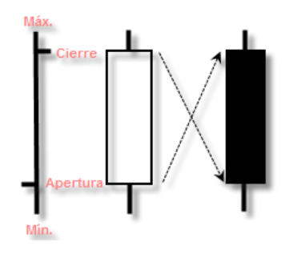
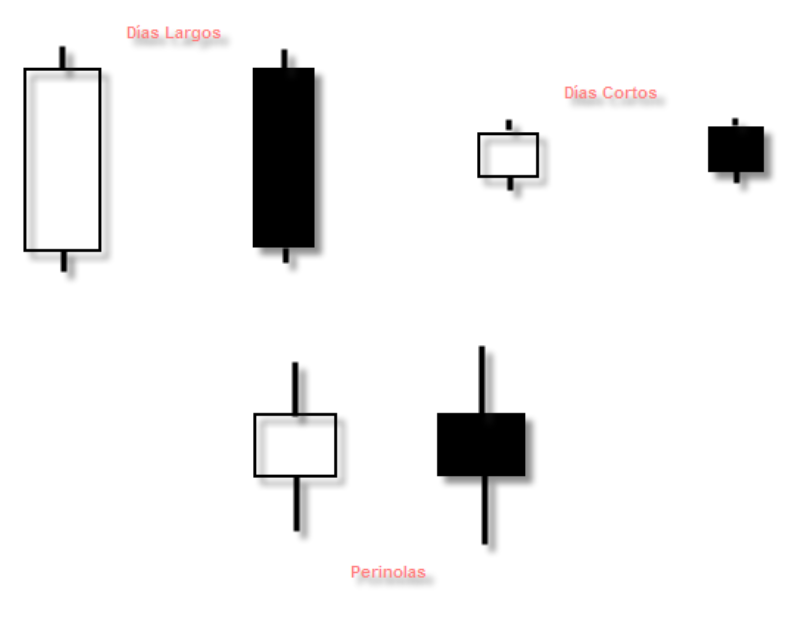
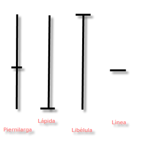

# <b>1. [Ecosistema de las criptomonedas](https://blogthinkbig.com/criptomonedas-diccionario)</b>

> Wallet, trade, token, Bitcoin, blockchain, exchange, Etherum... 
 El <b>*universo de las criptomonedas*</b> viene repleto de vocablos en inglés. Algunos son ya conocidos entre quienes están familiarizados con las <b>*finanzas y la economía*</b> en general. Otros conceptos vienen de la tecnología. Y un tercer grupo, directamente, ha surgido con las criptodivisas (criptomonedas). Sea como fuere, <b>*conviene conocerlos*</b> para saber en qué consiste el blockchain y los activos digitales.  
Lo primero que hay que hacer para empezar a operar con criptodivisas es <b>crear una cartera de criptomonedas</b> o *wallet* (cartera en inglés). 
A partir de ahí, te las verás con una lista de palabras, nombres comerciales y conceptos, generalmente en inglés. Algunos los entenderás al vuelo. Otros, conviene echar un vistazo a un diccionario o lista de <b>jerga cripto</b> como la siguiente.  

A continuación, recopilamos una selección de las palabras que más suelen aparecer al hablar de <b>criptomonedas y blockchain</b>. Tal vez heches en falta algún concepto, pero para empezar a operar con <b> Etherium o Bitcoin</b>, la siguiente terminología lo pondrá más fácil. Ya tendrás tiempo de conocer más adelante otros vocablos y acrónimos más técnicos.

## 1.1 Criptomoneda, criptodivisa o criptoactivo

> Estas tres palabras sirven para definir lo que en inglés se conoce como *cryptocurrency* o simplemente *crypto*. Se trata de una divisa alternativa o <b>moneda digital</b> basada en la criptografía para que las transacciones sean seguras. En concreto, emplea una tecnología conocida como *blockchain* o cadena de bloques.  
En la práctica, esto significa que tu dinero virtual está en una base de datos descentralizada. Tú posees unas claves que te permiten acceder a ese dinero. Las claves se guardan en un monedero virtual, conocido como *wallet* o *cryptowallet*.

## 1.2. Blockchain o cadena de bloques

> Esta tecnología es la base de las criptomonedas y de otros activos digitales como los NFTs. El *blockchain* o cadena de bloques es una cadena o serie de <b>bloques de información</b>. Cada bloque tiene <b>metadatos relativos</b> a otro bloque. Pero la información completa solamente puede conocerse accediendo a todos los bloque.  
Para hacer esto posible se emple criptografía, es decir, cifrado, funciones de resumen o *hash* y un registro contable distribuido. 
Primero,<b>criptografía asimétrica</b> o de dos claves. Esto significa que para acceder al contenido cifrado se requieren <b>dos claves o contraseñas</b>. Una pública y otra privada. La primera se puede compartir y tiene unas funciones limitadas. La otra es personal e intransferible y da acceso completo a un archivo u otro acceso (acceso a otro acceso).  
La función de resumen o *hash* sirve para convertir cualquier bloque arbitrario de datos en una nueva serie de caracteres con una longitud fija. Las funciones *hash* más populares son SHA-1, MD5 y SHA-2. Se suelen usar para recuperar contraseñas de forma segura o para identificar archivos y asegurarnos que no han sido alterados.  
Por su parte, el registro contable distribuido (en inglés DLT, *Distributed Ledger Technology). También se llama registro compartido o registro distribuido. Sirve para registrar transacciones de activos digitales. Ese registro se almacena en varias ubicaciones, de manera descentralizada.

## 1.3 Wallet, cryptowallet o monedero

> Es una de las claves de las criptomonedas. Si el dinero físico lo guardas en un monedero o billetero, tus activos digitales se guardan en un monedero. Pero en inglés suena mejor, *wallet*. También se puede llamar cartera de criptomonedas o *crypto wallet*.  
Un *wallet* es un software o programa de ordenador que almacena y permite intercambiar criptomonedas. Sin intermediarios. Se pueden usar desde la web, desde una aplicación de escritorio o desde una aplicación movil. Al crear un *wallet* obtienes dos claves. Una pública, que sirve para recibir dinero, y otra privada para acceder a tus activos digitales. A destacar que la *wallet* nos da <b>anonimato</b>. Nadie puede saber quién hay detrás de una cartera o monedero.  
Los monedero de criptodivisas pueden ser de varios tipos. Los más comunes son los *wallets* <b>hospedados o custodiados</b>. También se llama *exchange wallets*. Se usan para el intercambio de criptodivisas.Estos monedero están alojados en la plataforma de intercambio. 
Tiene sus ventajas, como que si olvidas la contraseña, puedes recuperarla. Pero tiene sus inconvenientes, como que dependes de un tercero. Si alguien *hackea* esa plataforma, puedes perder tus criptos.  
Segundo tipo de *wallet*. La <b>cartera o monedero sin custodia.</b> Te da más control sobre tus criptodivisas, ya que tú mismo te encargas de guardar el monedero en sí mismo. Si olvidas tus claves, perdiste ese dinero. Y para los más precavidos, existen *wallets* <b>físicas</b> 
Básicamente son un dispositivos USB que alberga la información del monedero y lo protege con un código adicional.

## 1.4 Bitcoin

> Si has oído hablar de criptomonedas seguramente habrá surgido el nombre de Bitcoin. Se trata de la criptodivisa más conocida. Con este nombre se conoce tanto el <b>protocolo de intercambio</b> como la red de pagos y el nombre de la propia <b>moneda o unidad de medida</b>. Esta moneda digital tiene su propio símbolo, una B mayúscula cruzada por una línea recta vertical. Sus abreviaturas son <b>BTC o XBT</b>.  
Su origen se remonta a 2009. Su creado, en principio, es Satoshi Nakamoto, si bien se desconoce si se trata de un nombre real o un alias. La identidad real del creador del Bitcoin no está del todo clara.
Curiosidades del Bitcoin. Se pueden crear un máximo de <b>21 millones de bitcoins</b>. Todo el mundo puede usar esta moneda porque <b>está descentralizada</b>. No hay un operador o entidad que centralice las operaciones y pueda bloquearlas o censurarlas. Las transacciones tampoco se pueden deshace. Y todas las unidades <b>se pueden intercambiar</b>. Estas y otras características son las bases de blockchain y las criptodivisas.

## 1.5 Minería de criptomonedas o cryptonmining

> Una de las particularidades de las criptomonedas es su creación en sí mismas. Las criptodivisas se generan y se distribuyen mediante redes de pares. Las conocerás por sus siglasa P2P (*peer to peer*). El uso más conocido de esta tecnología es el <b>intercambio de archivos</b>, que puede hacerse de forma legal, ilegal y/o alegal. Legalmente, hay empresas que emplean P2P para facilitar el envío de archivos de gran tamaño.  
Volviendo a las criptomonedas. La creación de criptodivisas como Bitcoin y otras se llama minería de criptomonedas. Básicamente consiste en <b>resolver problemas matemáticos de alta complejidad</b>. 
Problemas que solamente un procesador puede resolver. La recompensa a resolver ese problema es una unidad de la moneda en cuestión.  
En el caso del Bitcoin, la <b>tasa de generación</b> de nuevas monedas BTC se reduce un 50% cada 4 años, con un límite de 21 millones de unidades en circulación. De ahí que uno de los problemas o críticas que se les hace a las criptodivisas es que para crearlas <b>requieren de CPUs y GPUs potentes, lo que implica un alto consumo de electricidad.</b>

## 1.6 Ethereun

> Junto a Bitcoin, es la segunda criptomoneda más popular del mercado de criptos. Además, hace referencia al <b>protocolo</b> y a la plataforma de gestión de esta moneda. Sus creadores son <b>Vitalik Buterin</b> y <b>Gavin Wood</b>, entre otros. Además de como divisa digital, Ethereum ha servido de plataforma para crear otros activos digitales como videojuegos blockchain y <b>contenido NFT</b>.

## 1.7 Token

> Un *token* es un elemento virtual que surge en el ecosistema Ethereum. El token es la base de activos digitales como los NFT (*non fungible token*). Se pueden usar como moneda de cambio para adquirir dinero o para realizar acciones a cambio de ese intercambio. 
También se pueden usar como <b>compensación o premio</b> y cambiarse por otras cosas, de ahí su valor para actividades digitales como mundos virtuales, videojuegos o incluso con repercusión en el mundo físico.

## 1.8 Airdrop

> Con esta palabra se conoce un método empleado por proyectos de toda clase para <b>distribuir gratis tokens</b>. Como dije antes, es una estrategia comercial para tener repercusión, aumentar usuarios, ganar fidelidad, etc.

## 1.9 Trade, tradear, trading

> *Trade* en inglés significa comercio. Y es una palabra muy frecuente en ámbitos financieros. En bolsa mismamente, el *trading* es la compraventa de activos cotizados. Acciones, divisas, futuros... No es de extrañar que también se emplee este <b>vocabulario bursátil</b> en las criptomonedas, ya que uno de sus usos consiste en <b>vender y comprar criptodivisas</b> en función de su valor en dólares o euros.  
Por su parte, <b>tradear</b> no deja de ser un anglicismo que equivale a invertir, vender o comprar criptodivisas. No confundir con la plataforma del mismo nombre dedicada a operaciones bursátiles, Forex y CFDs.

# <b>2. [Exchange (criptomonedas)](https://www.youtube.com/watch?v=CpxC6qFqHxc)</b>

> Plataforma o mercado virtual en la que podemos realizar intercambios de criptomonedas (comprar o vender). 
Sirven como intermediarios y facilitan los movimientos financieros de los usuarios. En esta plataforma es donde se genera el precio de mercado que marca el valor de las criptomonedas en base a la oferta y la demanda.  
Las interfaces al usuario son generalmente intuitivas y sencillas de utilizar, con el objetivo de evitar complicar al mismo.
Pueden estar centralizadas o no, automatizadas para agilizar y evitar problemas al momento de la compra o venta. Nace en el 2009 de la necesidad de un usuario de Bitcoin, año en el que se realizó el primer intercambio de Bitcoin por dinero. Poco después en el año 2010 nace el primer *Exchange* **BITCOINMARKET**.  
¿Cómo funciona un exchange? 
Tal y como se mencionó en líneas previas, un exchange funciona como una casa de intercambio convencional. En la cuál cambiamos dinero por criptomonedas.  Para realizar el intercambio debemos escojer la plataforma que vamos a utilizar, estas se dividen básicamente en centralizadas y no centralizadas, lo cual trataremos en líneas posteriores.Una vez elegida la plataforma podemos realizar la solicitud de compra o venta mediante el tipo de pago más conveniente (tarjeta, transferencia, paypal, etc.)  
¿Centralizados o descentralizados? 
Los *exchanges* centralizados (**CEX**) usan terceros que median en las negociaciones de los usuarios de la plataforma. La empresa o persona centralizadora es quien controla las entradas y salidas de esta plataforma, por este trabajo recibe una comisión por cada negociación que realice sus cliente. 
Para acceder a esta plataforma se requieren pasar los controladores *know your customer* **(KYC)** y *anti money laundering* (**AML**). Esto implica que los usuarios deben identificarse debidamente antes de poder utilizar los servicios que la plataforma ofrece. 
Por lo tanto, no son plataformas que ofrezcan privacidad y anónimato a las negociaciones.  
Entre los *exchanges* centralizados más populares pueden mencionarse:  
* BINANCE
* COINBASE
* KRAKEN
* POLONIEX
 
> Por otra parte tenemos los *exchanges* descentralizados (**DEX**) 
En este caso la figura del mediador desaparece. Las negociaciones se realizan a travez de un software especializado que le permite a los clientes realizar sus transacciones en modo **P2P** (persona a persona), la interfaz se vuelve compleja y requiere que el usuario tenga un conocimiento previo del funcionamiento del sistema para poder operar. No existe perdida de privacidad ya que el usuario no requiere pasar por los procesos de control.  Debido a esto último, este tipo de *exchange* es muy criticado, ya que puede destinarse a la ejecución de transacciones ilícitas.  
Entre los *exchanges* descentralizados más populares pueden mencionarse:  
* ETHERDELTA
* UNISWAP
* BITSQUARE

> Ahora que conocemos las principales diferencias entre los *exchanges* centralizado (**CEX**) y descentralizados (**DEX**). Mencionamos el top 3 de *exchanges* más populares según coinmarketplace:
* BINANCE
* COINBASE
* KRAKEN
> Este posicionamiento está basado en función a:
- Tráfico
- Liquidez
- Volúmenes de comercio
- Confianza en la legitimidad de usuarios

# <b>3. [FTX](https://en.wikipedia.org/wiki/FTX_(company))</b>
> **FTX** es una plataforma de tipo *exchange* constituid en el país de Antigua y Barbuda, tiene su sede en Las Bahamas. 
A partir de febrero de 2022, el volumen de intercambio diario tiene un promedio de $10 mil millones (doláres) y supera el millon de usuarios. FTX.US, está disponibles para los residentes de EE.UU. FTX se fundó con el propósito de generar la mayor cantidad de riqueza posible para utilizarla en causas benéficas siguiendo el principio de *ganar para generar [altruismo eficaz](https://es.wikipedia.org/wiki/Altruismo_eficaz)*

## 3.1. [FTX-pythonAPI](https://analyzingalpha.com/ftx-rest-api-python#FTX_REST_API_Python_Tutorial)
## 3.2. Obtener datos historicos de FTX
> Es posible obtener el historial de precio en el mercado de las distintas criptodivisas actuales. Para ello FTX hace uso de los siguientes parámetros:
* **Resolución**: indica el periodo de muestreo al cual hacemos referencia, este parámetro puede tener valores específicos de tiempo, estos pueden ser desde minutos, días, meses hasta años.  
Ejemplo de url para el historial de Etherium en dólares: 
> - Minutos: https://ftx.com/api/markets/AAVE/USDT/candles?resolution=60
> - Horas: https://ftx.com/api/markets/AAVE/USDT/candles?resolution=3600
> - Días: https://ftx.com/api/markets/AAVE/USDT/candles?resolution=86400
> - Meses: https://ftx.com/api/markets/AAVE/USDT/candles?resolution=2592000

> Ver el archivo "./Documentos/Examples/FTX-API/Ejemplo FTX-API.ipynb", sección 4. Get Historical Data

# 4. Virtual Enviroments in Python
> The venv module is the new default way of creating basic virtual environments for new Python versions > 3.3. If you dive into virtual environments, you’ll quickly realize that there are a multitude of tools out there such as “virtualenv“, “pyenv“, and many more.

# 6. [Gráfico de velas](https://es.wikipedia.org/wiki/Gr%C3%A1fico_de_velas)

> En Economía, el *gráfico de velas* o velas japonesas es un tipo de gráfico muy utilizado en el análisis técnico bursátil. Refleja: 
* El precio de apertura de un [valor](https://es.wikipedia.org/wiki/T%C3%ADtulo_de_cr%C3%A9dito).
* el precio de cierre de un [valor](https://es.wikipedia.org/wiki/T%C3%ADtulo_de_cr%C3%A9dito).
* El máximo y mínimo que ha encontrado ese [valor](https://es.wikipedia.org/wiki/T%C3%ADtulo_de_cr%C3%A9dito). 
> Aunque los japoneses han estado utilizando esta técnica de gráficos, y análisis desde hace siglos, en el mundo occidental se ha hecho conocida en años recientes.
## 6.1. [Construcción](https://es.wikipedia.org/wiki/Gr%C3%A1fico_de_velas#Construcci%C3%B3n)
> La información utilizada para reflejar la situación de un [mercado](https://es.wikipedia.org/wiki/Mercado) mediante un gráfico de velas es la que se utiliza habitualmente para los gráficos de barras, o sea, los precios de apertura, máximo, mínimo y de cierre. Aunque utilizan exactamente la misma información, los gráficos de velas resultan visualmente más atractivos, y la información parece saltar de la página, facilitando su interpretación y análisis.  
 **Figura 1.0.** Vela japonesa, tendencia a la alza (blanca) o a la baja (negra)  
Es fácil adivinar de donde proviene el nombre. Se parecen a una vela con un trocito de pabilo. El rectángulo representa la diferencia entre el precio de apertura y el de cierre del mismo día, y se le llama cuerpo. Obsérvese que el cuerpo puede ser blanco o negro. Un **cuerpo blanco** significa que el precio de cierre fue mayor o más alto que el de apertura. El **cuerpo negro** significa que el precio de cierre fue más bajo que el de apertura. Los precios de apertura y cierre tienen mucha importancia en las velas japonesas. Las pequeñas rayas o líneas en la parte de arriba y de abajo del cuerpo se conocen como pabilos, pelos o sombras. La literatura japonesa de referencia utiliza muchos nombres diferentes para estas pequeñas líneas, lo cual resulta extraño, ya que representan los precios máximos y mínimos del día y en general, es información que los japoneses no consideran vital.  
Las diferentes formas de las velas tienen significados distintos, y los japoneses han definido velas primarias diferentes basándose en la relación de los precios de apertura, máximo, mínimo y de cierre. La comprensión de estas avelas básicas es el comienzo del análisis de este tipo de gráfico.

> ### **Velas básicas** 
> Las diferentes combinaciones de cuerpo/sombras tienen diferentes significados. Los días en los que la diferencia entre los precios de apertura y cierre es grande se llaman *días largos*, y del mismo modo los días en los que la diferencia entre los precios de apertura y cierre es pequeña se llaman *días cortos*. Esto hace referencia exclusivamente al cuerpo de la vela.  
 **Figura 1.1.** Velas básicas  
Las *perinolas* son días en los qsue las velas tienen cuerpos pequeños con sombras superiores e inferiores más largas que el propio cuerpo. El color del cuerpo es importante en las velas perinola, que se consideran días de indesición.  
Cuando el precio de apertura y el de cierre son iguales, se les llama velas 'd'oji. Las velas doji pueden tener sombras de largo variado y se discute si el precio de apertura y el de cierre deben ser exactamente el mismo. Es un momento en el que los precios deben ser casi iguales, especialmente cuando se trata de grandes movimiento de los precios.  
 **Figura 1.2.** Velas básicas  
Las Velas Japonesas son una de las mejores formas de visualizar los gráficos en los Mercados Financieros. Un patrón de velas es un retrato psicológico de la mentalidad de los operadores en aquel momento. 
Muestra vívidamente las acciones de los operadores a medida que pasa el tiempo en el mercado, y el mero hecho de que los humanos reaccionen de igual forma en situaciones similares hace que el análisis del patrón de velas funcione.

# 7. Deploy streamlit
> Para el deploy del proyecto en la plataforma de [Streamlit](https://streamlit.io/) vamos a requerir los conocimientos básicos para mostra nuestra data de la mejor manera, con el objetivo de realizar un dashboar intuitivo y sencillo, esto último sin caer en exceso de simplicidad.
* [Botones en streamlit](https://docs.streamlit.io/library/api-reference/widgets/st.button): la función st.button nos permite mostrar un widget de botón. Ejemplo en la carpeta examples.

# 8. Palabras clave

* [REST](https://es.wikipedia.org/wiki/Transferencia_de_Estado_Representacional): La transferencia de estado representacional o REST es un estilo de arquitectura software para sistemas hipermedia distribuidos como la World Wide Web. 
* [WebSocket](https://es.wikipedia.org/wiki/WebSocket): WebSocket es una tecnología que proporciona un canal de comunicación bidireccional y full-duplex sobre un único socket TCP. Está diseñada para ser implementada en navegadores y servidores web, pero puede utilizarse por cualquier aplicación cliente/servidor. 
* [API](https://es.wikipedia.org/wiki/Interfaz_de_programaci%C3%B3n_de_aplicaciones): La interfaz de programación de aplicaciones, conocida también por la sigla API, en inglés, application programming interface, es un conjunto de subrutinas, funciones y procedimientos que ofrece cierta biblioteca para ser utilizada por otro software como una capa de abstracción. 
* [TCP](https://es.wikipedia.org/wiki/Protocolo_de_control_de_transmisi%C3%B3n): Protocolo de control de transmisión es uno de los protocolos fundamentales en Internet. Fue creado entre los años 1973 y 1974 por Vint Cerf y Robert Kahn. 
* [WAN](https://es.wikipedia.org/wiki/Red_de_%C3%A1rea_amplia): Una red de área amplia, o WAN, es una red de computadoras que une e interconecta varias redes de ámbito geográfico menor, por ejemplo redes de área local, aunque sus miembros no estén todos en una misma ubicación física. 
* [SSL/TLS](https://www.google.com/search?q=SSL%2FTLS&oq=SSL%2FTLS&aqs=chrome..69i57j69i58.495j0j1&sourceid=chrome&ie=UTF-8): Seguridad de la capa de transporte y su antecesor Secure Sockets Layer son protocolos criptográficos, que proporcionan comunicaciones seguras por una red, comúnmente Internet.
* [Bid price](https://es.wikipedia.org/wiki/Precio_de_demanda): El precio de demanda es el precio máximo al que el comprador está dispuesto a pagar. En una compraventa, el precio de demanda se contrasta con el precio de oferta, y a la diferencia entre ellos se le llama diferencial o margen de compraventa.

* [Ask price](https://www.youtube.com/watch?v=9WFuxnQalTg): El precio de demanda es el precio máximo al que el vendedor está dispuesto a vender.

* [Mercado](https://es.wikipedia.org/wiki/Gr%C3%A1fico_de_velas#Construcci%C3%B3n): En economía, un mercado es un conjunto de transacciones de procesos o intercambio de bienes o servicios entre individuos.

* [Transacción](https://es.wikipedia.org/wiki/Transacci%C3%B3n_financiera): Una transacción financiera es un acuerdo, comunicación o movimiento llevado a cabo entre un comprador y un vendedor en la que se intercambian un activo contra un pago.

* [Futures](https://en.wikipedia.org/wiki/Futures_contract): En finanzas, un contrato de futuros es un contrato legal estandarizado para comprar o vender algo a un precio predeterminado para su entrega en un momento específico en el futuro, entre partes que aún no se conocen entre sí. El activo objeto de la transacción suele ser una mercancía o un instrumento financiero.

* [Web Widgets](https://es.wikipedia.org/wiki/Widget#Diferentes_tipos_de_widgets): partes de código que representan funcionalidades o contenidos que pueden ser instalados y ejecutados en tu página de manera sencilla.

# 6. Bibliografía:
* https://blogthinkbig.com/criptomonedas-diccionario
* https://www.youtube.com/watch?v=CpxC6qFqHxc
* https://en.wikipedia.org/wiki/FTX_(company)
* https://es.wikipedia.org/wiki/Altruismo_eficaz
* https://help.ftx.com/hc/en-us/articles/360028807171-API-docs
* https://pypi.org/project/python-dev-tools/
* https://www.youtube.com/watch?v=PxysVcWXI_Q
* https://es.wikipedia.org/wiki/Gr%C3%A1fico_de_velas
* https://plotly.com/python/candlestick-charts/
* https://algotrading101.com/learn/ftx-api-guide/
* https://pandas.pydata.org/docs/reference/api/pandas.to_datetime.html
* https://es.wikipedia.org/wiki/Tiempo_Unix